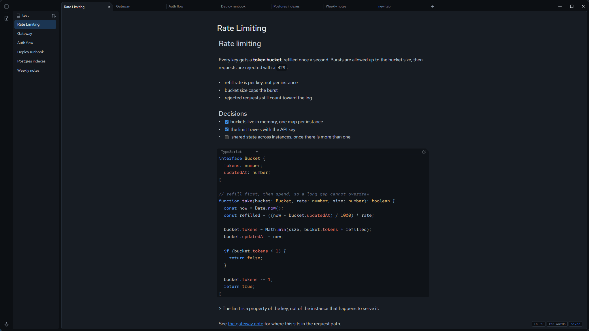
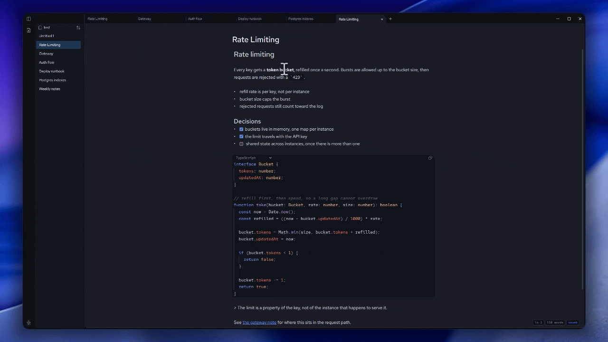
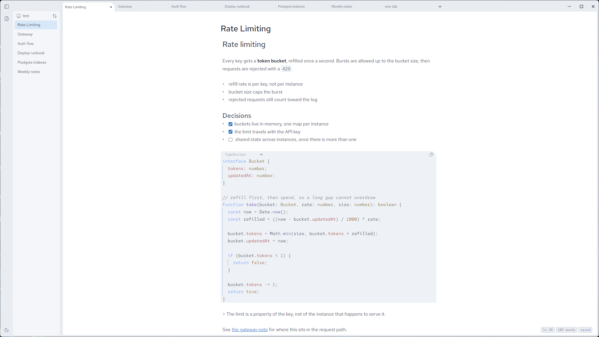

<p align="center">
  
</p>

<h1 align="center">NovaNotes</h1>

<p align="center">A markdown notes app for technical work. Your notes stay as plain files on your own machine.</p>

<p align="center">
  <a href="https://github.com/BreyKM/NovaNotes/actions/workflows/ci.yml"></a>
</p>

<p align="center">
  
</p>

NovaNotes is a desktop notes app built on Electron, Svelte 5 and CodeMirror 6. It opens a folder of markdown files and edits them in place: no database, no sync service, no proprietary format. What you see in the editor is what ends up in the file, byte for byte.

I built it to learn how a real desktop application is put together, so the repository also records how it was built: every significant decision is written down in [`docs/adr/`](docs/adr), and the interface is specified in [`docs/design.md`](docs/design.md) before it is coded.

## Features

- **Plain markdown files.** Open any folder of `.md` files. Notes are saved atomically, and frontmatter is preserved untouched.
- **Live preview editing.** Headings, emphasis, lists, links and code render as you type, while the file keeps its exact markdown. Move the cursor into a line and the markup reappears.
- **Code blocks** with syntax highlighting, a language picker and a copy button. Indentation guides follow the block's own indent width.
- **Tabs** for several notes at once, with a sidebar you can resize or collapse.
- **Autosave** that serializes writes, so a save can never overtake an earlier one, with a status chip showing whether the file is written.
- **Dark and light themes,** applied before the window paints, so there is no flash on launch.

<p align="center">
  
</p>

<p align="center"><em>Markup appears when the cursor enters a line, and hides again when it leaves. The file keeps the markdown either way.</em></p>

<p align="center">
  
</p>

## Tech stack

| Layer     | Choice                                        |
| --------- | --------------------------------------------- |
| Shell     | Electron 34                                   |
| Interface | Svelte 5, Tailwind CSS 4                      |
| Editor    | CodeMirror 6 with a custom live-preview layer |
| Language  | TypeScript, strict                            |
| Tests     | Vitest - 213 across 15 files                  |
| Fonts     | Red Hat Text and Red Hat Mono, bundled        |

## Design and decisions

- [`docs/design.md`](docs/design.md) is the interface specification: color tokens, type scale, layout, components and motion. Changes to the interface start there.
- [`docs/adr/`](docs/adr) holds the architecture decision records, why note identity became the file path, why Milkdown was replaced with CodeMirror, why saves are atomic and serialized, and what each decision cost.

## How it works

**Live preview** is a CodeMirror `StateField` that walks the syntax tree and returns decorations: markup is hidden with a replacing decoration unless the cursor is inside it, and code blocks, list markers and checkboxes become widgets. Nothing rewrites the document, so what you type is what the file holds. See [`src/lib/Components/Content/editor/`](src/lib/Components/Content/editor).

**Saving** is serialized: edits are throttled into a queue where each write waits for the previous one, so a slow save can never land after a newer one. Files are written to a temp file and renamed into place, so a crash mid-write cannot truncate a note.

**Note identity is the file path.** An earlier version generated UUIDs in a sidecar file; [ADR 0006](docs/adr/0006-use-the-file-path-as-note-identity.md) records why that was replaced and what it cost.

**The processes are split** the way Electron intends: the main process owns the file system and windows, the renderer owns state and rendering, and they talk over a typed preload bridge ([`shared/types.d.ts`](shared/types.d.ts) is the contract both sides import).

## Running it

Requires Node 22.

```bash
npm install
npm run dev
```

Other scripts:

```bash
npm test           # Vitest
npm run check      # svelte-check
npm run check:electron
npm run make       # package the app with Electron Forge
```

## Where your data lives

Your notes are the markdown files in the folder you opened, nothing is copied elsewhere. The app stores only its own state (which notebook is open, sidebar width, sort order, theme) in `%APPDATA%\NovaNotes\store.json` on Windows, and the equivalent application-support folder on macOS.

## Project layout

```
electron/   main process: windows, IPC, file access
src/        renderer: Svelte components and stores
  store/    application state (notes, tabs, layout, theme)
  lib/Components/Content/editor/   CodeMirror extensions
shared/     types used by both processes
docs/       design specification and decision records
```

## Status

NovaNotes is under active development and not packaged for release yet. It is developed and tested on Windows; macOS is supported in code but not yet verified.

Next up: a command palette, a dropdown for overflowing tabs, and switching notebooks without restarting.

## License

MIT — see [LICENSE](LICENSE).
